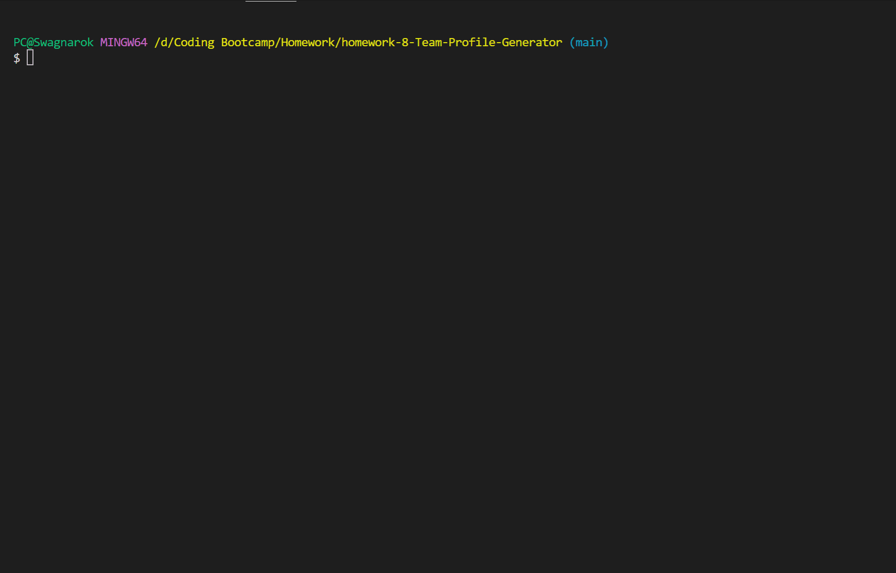

# Team_Profile_Generator

## Description

A Node JS application that will create an HTML file consisting of the user's team members they have entered into the app.  
App can be found deployed [here](https://github.com/Swagnarok630/Team_Profile_Generator).

## Table of Contents

* [Criteria](#criteria)
* [Installation](#installation)
* [Usage](#usage)
* [Contributing](#contributing)
* [Tests](#tests)
* [Questions](#questions)
* [Notes](#notes)
* [License](#license)

## Criteria

* We want a command-line application that accepts user input and choices
* The application will give the user multiple prompts requesting information regarding their team
   * Adding new team members
      * Adding a manager
      * Adding an engineer
      * Adding an intern
   * Employee's name
   * Employee's ID
   * Employee's Email
   * Manager's office number
   * Engineer's GitHub page
   * Intern's school of study
   * Create the HTML page
* An HTML file is created when the user finishes inputting all data
   * Page reflects created team, with each member in their own card
   * Page is responsive
   * Page is neatly stylized
   * Emails can be clicked to open up default email program
   * Github profiles can be clicked to open user page in a new tab

## Installation Instructions

We just perform an npm install and then run the application through node in the root directory.

## Usage

Once the application is loaded, the user will be prompted with questions that they will need to answer to proceed. Once all questions have been answered, the user may proceed to generate an HTML file before exiting the app.

Video showing full use of the application can be found [here](https://www.youtube.com/watch?v=njHjup0ZTX4)

## Contributing

Anyone is welcome to contribute to this project as they see fit, as there can be many more improvements made. Look for my contacts in the upcoming Questions section.

## Tests

Test cases have been provided for employee classes, all functional.

## Questions

If there are any questions or concerns regarding the app, you may contact me through the following:
* Github - <https://github.com/Swagnarok630>
* E-mail - swagnarok.630@gmail.com

## Notes

Sample HTML file generated from app will be named index.html and can be found in the dist folder.

### Future Features
* Possibly add validation for emails and numeric values to ensure accurate data added
* Possibly add other types of employees

## License

Copyright (c) Darryl Le. All rights reserved.  
Licensed under [MIT](https://opensource.org/licenses/MIT) license(s).
